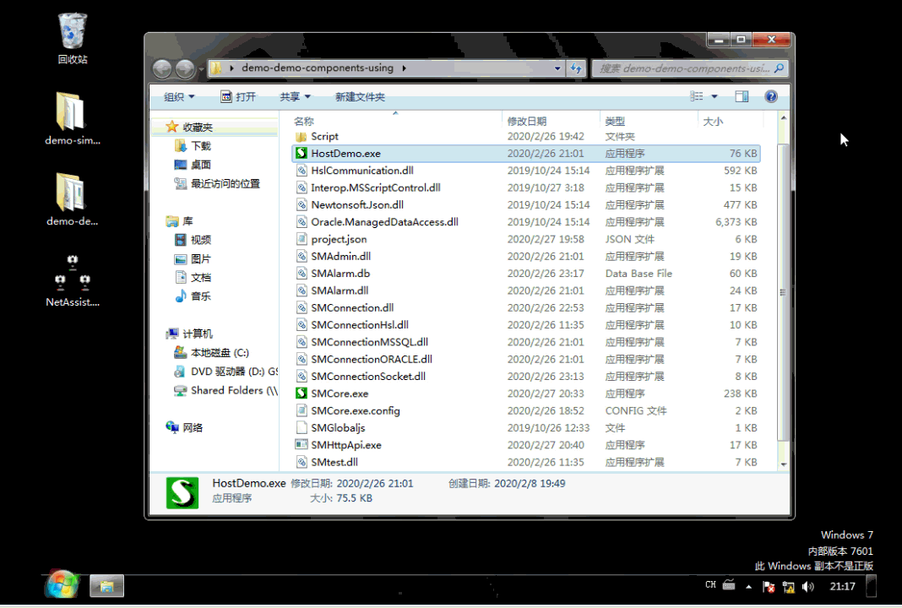

# 4.HttpApi组件
配置代码：
```json
		//演示HttpApi组件
		{
			"Name": "HttpApi",
			"TypeName": "SMHttpApi",
		},		
```
直接运行看一下效果：


可以看到，这个组件是一个有窗体界面的组件，实现了简单的HTTP客户端和HTTP服务端的功能。并且它自身是一个EXE文件可以作为工具软件使用。

接下来用脚本测试一下它的功能调用：
```js
	case "访问Http":
		var Http = so.Manager.GetSOObject("HttpApi");//获取HttpApi对象
		//创建一个简单的HTTP服务
		if(Http.ServerActive==false)
		{	
			Http.ServerPort=666;
			Http.ServerStart();
			this.Count=1;
			alert("Start");
		}
		this.Count++;
		//访问创建的HTTP
		var txt = Http.HttpRequest("http://localhost:666","当前请求值："+this.Count);
		alert(txt);
		so.SetNextState("访问Http",1000);
		
		break;
```

效果如下：
 


可以看到，脚本控制了HTTP组件，开启了HTTP服务端，并且以客户端HTTP访问的方式获取到了数据。

并且，在HttpApi组件的界面中能够实时监听客户端和服务端收发的数据、通过按钮操作可以重新开启Http服务、可以强制服务端输出的结果！我们在调试过程中用到的操作，在生产环境下一样可以使用，是不是很方便呢。

这就是所谓的手自一体，手动操作与自动运行密切接合的一种开发思路，一种让代码量少到极致，又能解决随时人工干预的自动化解决方案！
