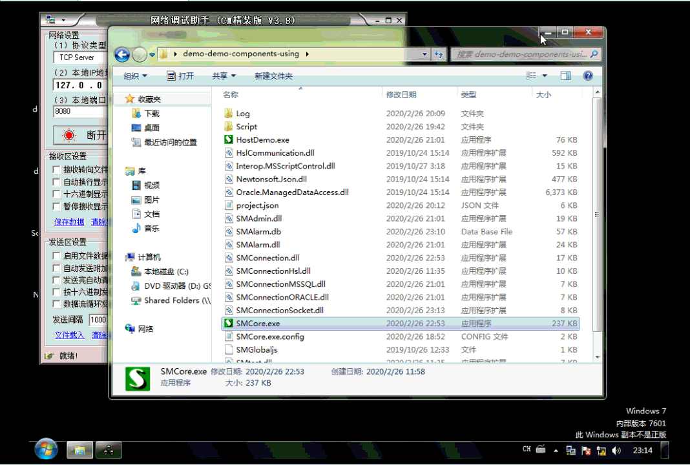

# Socket组件、报警组件
配置代码：
```json
		//演示脚本里用到的TCP连接
		{
			"Name": "TCP",
			"Auto": 1,
			"TypeName": "SMConnectionSocket",
			"ConnectionString": "127.0.0.1:8080:Tcp:Syn",//SMConnectionSocket 连接字符串的格式，IP:端口:Tcp/Udp:Syn(同步方式)/Asyn(异步方式)，详见实现代码
			"ReadTimeOut":5000
		},

		//一款极为好用的报警管理界面，推荐使用
		{
			"Auto": 0,
			"Name":"Alarm",
			"Tip":"报警信息",
			"TypeName":"SMAlarmForm",
			//是否自动弹出报警处理界面
			"IsAutoPopUp":1,
			"ShowInTrayMenu":true,
		},
```

脚本代码：
```js
	case "访问TCP":	
		var TCP=so.Manager.GetSOObject("TCP");//获取TCP对象
		if(TCP.Connected)
		{
			TCP.SendString("请求数据");//向TCP设备请求数据
		}
		else{			
			so.Status="TCP未连接。";
		}
		so.SetNextState("访问TCP-接收",1000,"");
		break;
	case "访问TCP-接收":
		var TCP=so.Manager.GetSOObject("TCP");//获取TCP对象
		if(TCP.Connected)
		{
			try{
				var data=TCP.RecvString("!");//同步方式读取数据
				so.Status="收到的数据："+data;//显示到界面上
				TCP.SendString("数据已经收到（"+data+"）下次聊！");//将数据返回给TCP设备表示收到
			}
			catch(E){//超时等异常情况
				var Alarm = so.Manager.GetSOObject("Alarm");//获取Alarm对象
				Alarm.AddSOAlarm(so, E.message, "重试,重试（再次发送请求）,跳过");//添加一条报警内容,提供三个处理选项
				so.SetNextState("访问TCP-异常处理",0);
				return;
			}
		}
		else{
			so.Status="TCP未连接。";
		}
		so.SetNextState("访问mssql",1000,"");
		break;
	case "访问TCP-异常处理":
		var Alarm = so.Manager.GetSOObject("Alarm");//获取Alarm对象
		var Reply = Alarm.ReadAlarmReply(so.Name);
		if(Reply=="重试")
		{
			so.SetNextState("访问TCP-接收",0,"正在重试");
		}
		else if(Reply=="重试（再次发送请求）")
		{
			so.SetNextState("访问TCP",0,"正在重试");
		}
		else if(Reply=="跳过")
		{
			so.SetNextState("",0,"正在重试");
		}
		else
			so.RepeatState(1000,"等待人工处理报警");//重复当前状态，延时5秒执行
		break;	
```
###### 结果如下：
