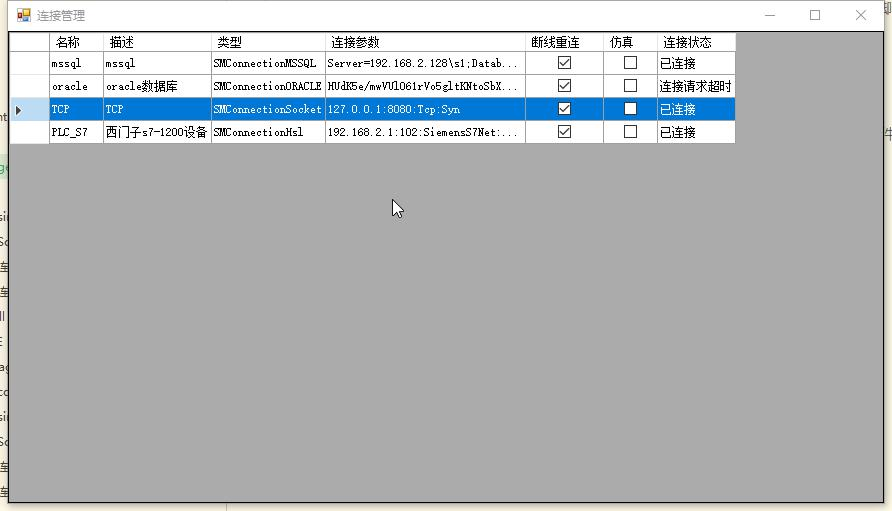
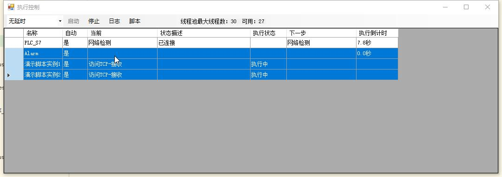
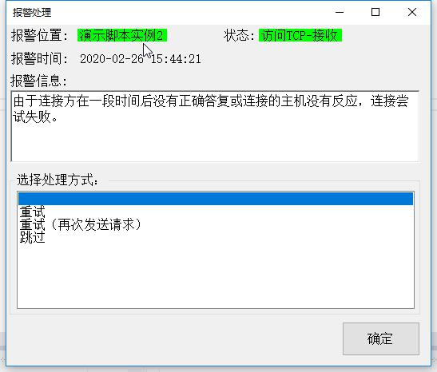
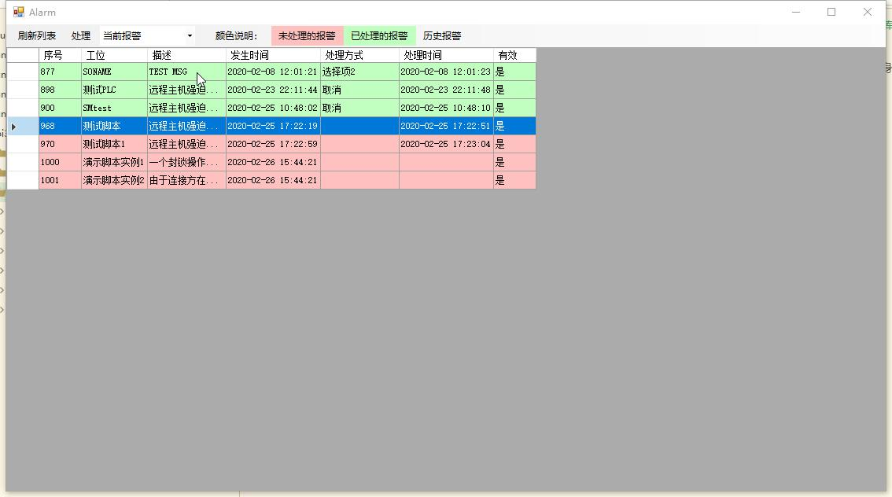

# 常用组件的使用
StateManager状态机组件可以是实现了IState接口的C#类，也可以是实现了3个接口函数的脚本。本演示中的脚本自身也是个组件。

如果要使用第三方功能，只需要编写实现接口的中间件即可。

目前可用的组件包括： 
1. 连接管理组件

2. 执行控制组件

3. 报警组件

4. 连接PLC的组件（使用了第三方组件）
5. 连接微软数据库的组件
6. 连接Socket的组件。

其他组件陆续开发中。。。也欢迎大家共同参与开发！（详加左侧QQ群）
