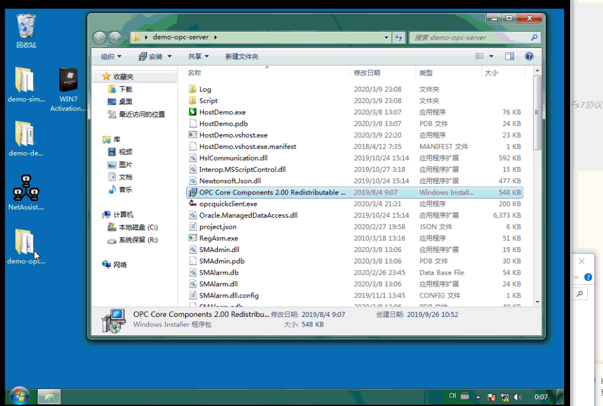

# 5.搭建OPC服务器
这个演示将使用StateManager的连接资源来快速搭建OPC服务器，实现自定义数据来源的OPC服务。
服务器采用delphi编写的SMOPCServer.exe，它通过C#编写的SMOPCDevice.dll（ActiveX组件），创建了StateManager状态机并访问其中配置的连接资源。

连接资源的配置代码：SMOPCDevice.json
```json
{
	"SO": [
		{
			"Name": "PLC_S7",
			"Tip": "西门子s7-1200设备",
			"Auto": 1,//此设备发生网络中断时将自动重连
			"TypeName": "SMConnectionHsl",
			"ConnectionString": "192.168.2.1:102:SiemensS7Net:s1200",//SMConnectionHsl 连接字符串的格式，IP:端口:SiemensS7Net（西门子s7协议）/MelsecMcNet（三菱Mc协议设备）...:s1200/s1500...，详见实现代码
			//连接超时等更多配置详见组件源代码）
		},		
  ]
}
```

这里只演示一个PLC设备的连接，如需多种设备，只需添加相应的状态机实例，即可实现从OPC客户端访问。不需要脚本代码，当然也可以编写脚本来实现类似触发器的功能。

SMOPCDevice.dll以ActiveX方式实现了非托管程序与托管程序的对接，同时也是StateManager的宿主程序，而连接资源则可以是任意状态机组件。

###### 效果如下：


可以看到，相比KEP等大型OPC服务器，安装过程极为简单。可连接的设备类型取决于你配置什么样的连接资源，可以是PLC、扫码枪、485通讯、数据库等等，自由度极高。

你会发现，与其购买一套臃肿的、傻瓜式的OPC服务器，不如自己动手组装一个，让一切都在你的掌控之中！

