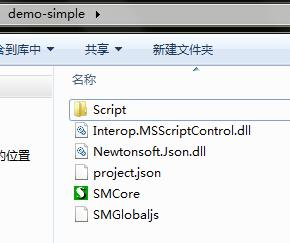
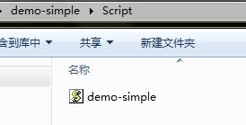
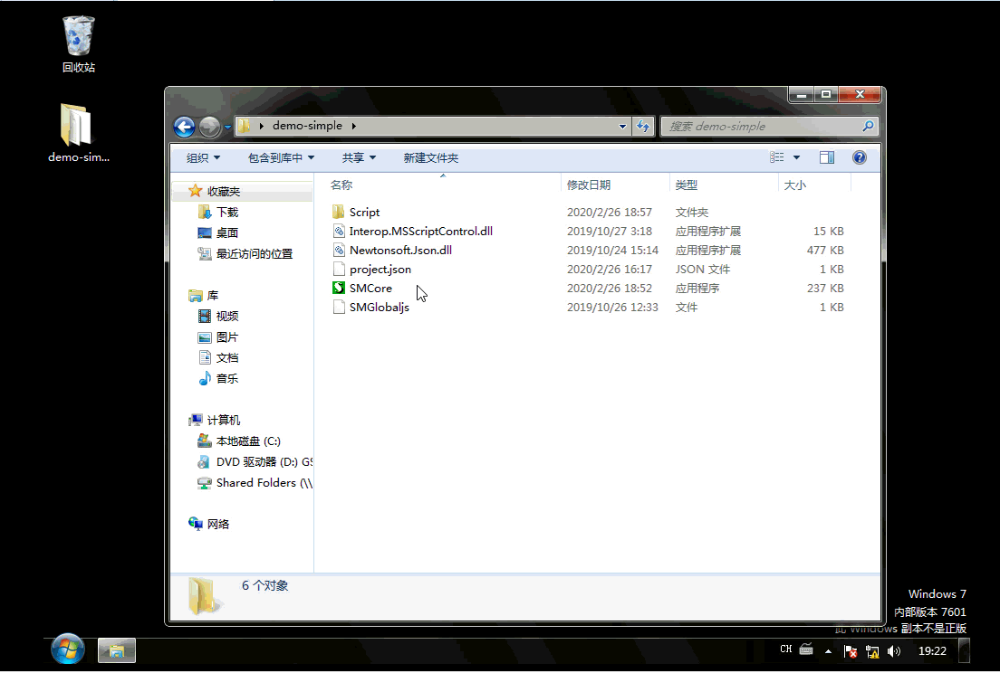

# 一个简单的示例

用到的文件：




###### 看一下主要文件内容：

project.json（配置文件）
```json
{
	"SO": [
		{
			"Auto": 1,
			"Name": "最简单的演示",
			"TypeName": "demo-simple",
		}
	]
}
```

demo-simple.js（脚本文件）
```js
function StateHandle(so){
	switch(so.State){
	case "":	
		so.SetData("v",1);
		so.SetNextState("加1",1000);//延时1秒后进入下一周状态”加1“
		alert("确定后开始。。。");
		so.Log("开始..");
		break;			
	case "加1":
		var v=so.GetData("v");
		if(v>10)
		{
			so.Log("完成");
			so.OpenLogFile();
			alert("完成");
			so.SetNextState("完成",0);
			return;
		}
		so.Log("v="+v);
		v = v + 1;
		so.SetData("v",v);
		so.RepeatState(10);//延时10毫秒后重复当前状态
		break;	
	case "完成":
		so.Auto=false;
		break;
	}
}

function StateInit(so)
{
}

function StateFinit(so)
{
}
```

###### 结果



我们看到，程序运行后自动执行了脚本，弹窗阻塞了脚本的执行。点确定后，自动完成了10次加1操作，即:重复了10次"加1"状态，最后进入“完成”状态并关闭了自动执行。
脚本中以日志方式记录了过程：
```log
2020-02-26 19:22:57:705	最简单的演示		开始..
2020-02-26 19:22:57:721	最简单的演示		v=1
2020-02-26 19:22:57:736	最简单的演示		v=2
2020-02-26 19:22:57:752	最简单的演示		v=3
2020-02-26 19:22:57:767	最简单的演示		v=4
2020-02-26 19:22:57:783	最简单的演示		v=5
2020-02-26 19:22:57:799	最简单的演示		v=6
2020-02-26 19:22:57:814	最简单的演示		v=7
2020-02-26 19:22:57:830	最简单的演示		v=8
2020-02-26 19:22:57:845	最简单的演示		v=9
2020-02-26 19:22:57:861	最简单的演示		v=10
2020-02-26 19:22:57:877	最简单的演示		完成
```
