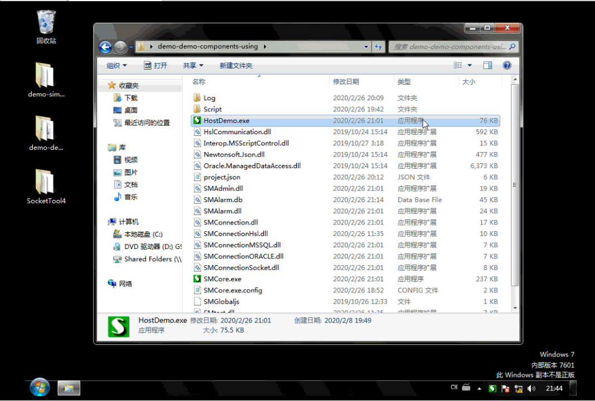

# 1.连接PLC（使用了第三方组件）

配置代码：
```json
		//演示脚本里用到的PLC连接
		{
			"Name": "PLC_S7",
			"Tip": "西门子s7-1200设备",
			"Auto": 1,
			"TypeName": "SMConnectionHsl",
			"ConnectionString": "192.168.2.1:102:SiemensS7Net:s1200",//SMConnectionHsl 连接字符串的格式，IP:端口:SiemensS7Net（西门子s7协议）/MelsecMcNet（三菱Mc协议设备）...:s1200/s1500...，详见实现代码
		},		
```

脚本代码：
```js
	case "访问西门子PLC":
		var PLC_S7=so.Manager.GetSOObject("PLC_S7");//获取PLC对象
		if(PLC_S7.Connected){//如果已连接
			var v=PLC_S7.ReadBool("M100"); //从PLC读取线圈M100
			PLC_S7.Write("M100",!v); //数据取反后写入PLC
			so.Status=v; //显示到界面上的状态详情
		}
		else{			
			so.Status="PLC_S7未连接。"//显示到界面上
		}
		so.SetNextState("访问西门子PLC",1000,"");//进入下一状态：访问TCP，延时1秒执行
		break;
```
###### 效果如下：

