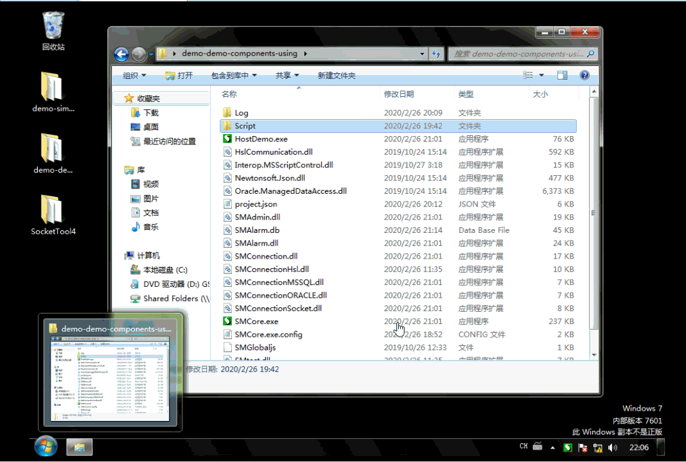

# 连接微软数据库
配置代码：
```json
		//演示脚本里用到的微软数据库连接
		{
			"Name": "mssql",
			"Auto": 1,
			"TypeName": "SMConnectionMSSQL",
			"ConnectionString": "Server=192.168.2.128\\s1;Database=Test;uid=sa;pwd=123456",//连接自符串
		},
```
脚本代码：
```js
	case "访问mssql": 
			var mssql=so.Manager.GetSOObject("mssql");//获取mssql对象
			if(mssql.connected){
				var v=mssql.ReadFirstInt("select TESTVALUE from Test where TESTNAME='测试数据'");//从sql server数据库读取一个数据
				so.status="从数据库读取到:"+v;//显示到界面上
				v=v+1;
				mssql.Execute("update Test set TESTVALUE ="+ v +" where  TESTNAME='测试数据'")//加1后回写到数据库
			}
			else{
				so.status="数据库未连接。"
			}
		so.SetNextState("访问mssql",2000);
		break;
```
###### 结果如下：


